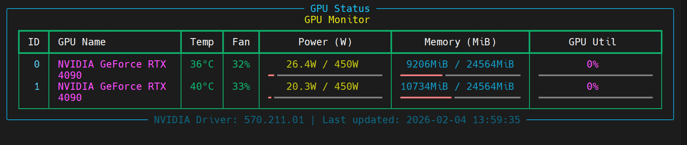

# GPU Monitor CLI

A simple, command-line based GPU monitoring tool for NVIDIA GPUs that displays real-time usage statistics.



## Features

- Displays detailed information for each detected NVIDIA GPU.
- Real-time updates of key metrics.
- Information displayed includes:
    - GPU ID and Name
    - Temperature (with color-coding for high temps)
    - Fan Speed
    - Power Usage (W) and Power Limit (W) with a progress bar
    - Memory Usage (MiB) and Total Memory (MiB) with a progress bar
    - GPU Utilization (%) with a progress bar
- Shows the current NVIDIA driver version.
- Clean, table-based layout using the `rich` library.

## Requirements

- Python 3
- `pip`

The following Python libraries are required:

- `rich`
- `pynvml`

These are listed in the `requirements.txt` file.

## Installation

1. Clone this repository or download the source code.
2. Open a terminal in the project directory.
3. Install the required packages using pip:

   ```bash
   pip install -r requirements.txt
   ```

## Usage

To run the monitor, simply execute the `gpu_monitor.py` script:

```bash
python gpu_monitor.py
```

Press `Ctrl+C` to stop the monitor.
